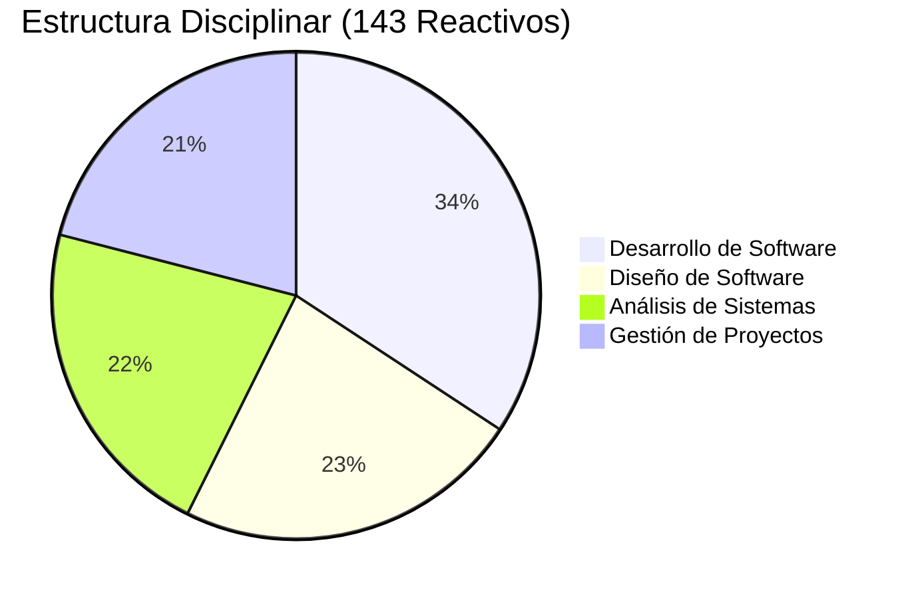
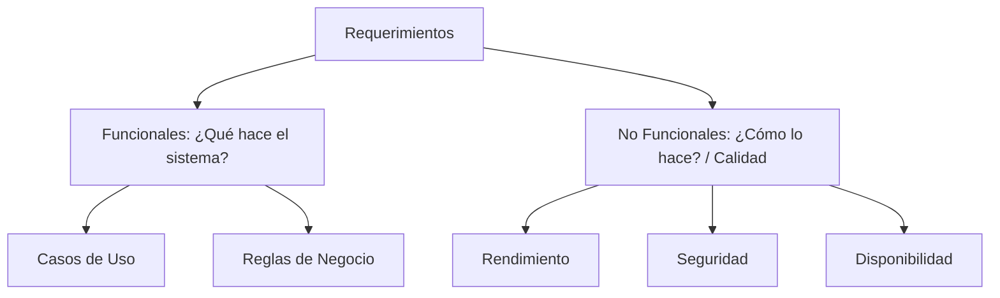
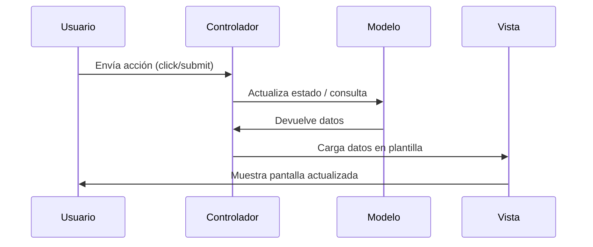
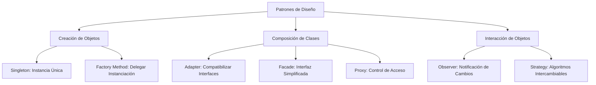
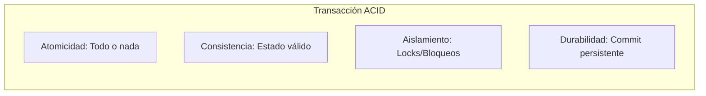
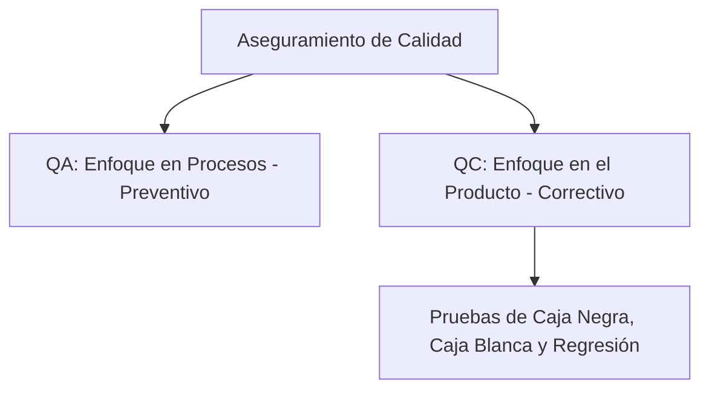

# 🎯 Temario de Alto Rendimiento: EGEL Plus ISOFT

> [!IMPORTANT]
> Este temario ha sido estructurado con formato visual premium y técnicas de aprendizaje activo para asegurar un desempeño de **Sobresaliente / 10** en tu examen. Contiene diagramas, tablas comparativas y alertas clave basadas en los reactivos oficiales de CENEVAL y la guía de estudio de la UNITEC.

---

## 🗺️ Distribución del Examen



| Sección | Áreas | Reactivos | Peso Relativo |
| :--- | :--- | :---: | :---: |
| **Sección Disciplinar** | Análisis (31) + Diseño (33) + Desarrollo (49) + Gestión (30) | **143** | 70% |
| **Sección Transversal** | Comprensión Lectora (30) + Redacción Indirecta (30) | **60** | 30% |
| **Total** | | **203** | **100%** |

---

## Área 1: Análisis de Sistemas de Software (31 Reactivos)

Este bloque evalúa la elicitación, especificación, modelado y validación de requerimientos.

### 1.1 Requerimientos Funcionales vs. No Funcionales



*   **Requerimientos Funcionales (RF):** Describen las acciones que el sistema debe ser capaz de ejecutar (ej. procesar pago, registrar usuario).
*   **Requerimientos No Funcionales (RNF):** Atributos de calidad y restricciones técnicas.

> [!WARNING]
> **Pregunta clásica de examen:** Un requerimiento del tipo *"La interfaz debe ser amigable"* es un **mal requerimiento** por ser subjetivo y no verificable. Un RNF de calidad debe ser medible: *"El tiempo de respuesta del login debe ser menor a 3 segundos bajo una carga de 1000 usuarios concurrentes"*.

---

### 1.2 Técnicas de Elicitación (Obtención de Requisitos)

| Técnica | Cuándo utilizarla | Características clave |
| :--- | :--- | :--- |
| **Entrevista Etnográfica** | El usuario tiene dificultad para expresar su proceso de forma verbal. | El analista se sumerge en el entorno real y observa la operación diaria. |
| **JAD / Workshops** | Se requiere llegar a un consenso rápido con múltiples stakeholders. | Reuniones de diseño conjunto altamente estructuradas. |
| **Cuestionarios / Encuestas** | El grupo de usuarios finales es masivo o está distribuido geográficamente. | Datos cuantitativos fáciles de procesar. |
| **Historias de Usuario** | Proyectos con metodologías ágiles (Scrum, XP). | Formato: *Como / Quiero / Para*. Deben ser **INVEST**. |

---

### 1.3 Casos de Uso (UML)

```mermaid
usecaseDiagram
    actor Usuario
    actor Administrador
    Usuario --> (Iniciar Sesión)
    (Iniciar Sesión) ..> (Validar Credenciales) : <<include>>
    (Iniciar Sesión) <.. (Recuperar Contraseña) : <<extend>>
    Administrador --> (Iniciar Sesión)
```

*   **`<<include>>` (Inclusión):** El caso de uso base requiere **obligatoriamente** del caso de uso incluido para completarse.
*   **`<<extend>>` (Extensión):** Comportamiento **opcional** que solo se ejecuta bajo condiciones específicas.

---

## Área 2: Diseño de Sistemas de Software (33 Reactivos)

### 2.1 Patrones Arquitectónicos y el Modelo 4+1

*   **Modelo-Vista-Controlador (MVC):** Separa la presentación de la lógica de negocio y el acceso a datos.



*   **Microservicios:** Arquitectura distribuida donde cada servicio es autónomo y se comunica asíncronamente (REST, RabbitMQ, Kafka).

> [!NOTE]
> **Modelo de Vistas 4+1 de Kruchten:**
> *   **Vista Lógica:** Describe las abstracciones (Diagrama de Clases).
> *   **Vista de Proceso:** Hilos, concurrencia y rendimiento.
> *   **Vista de Desarrollo/Implementación:** Estructura de los archivos de código (Componentes y Paquetes).
> *   **Vista Física/Despliegue:** Servidores físicos, red y topología.
> *   **Escenarios (+1):** Casos de uso que integran todas las anteriores.

---

### 2.2 Cohesión y Acoplamiento

> [!TIP]
> **La regla de oro del diseño de software:** **Alta Cohesión** (cada clase hace una sola cosa bien) y **Bajo Acoplamiento** (mínima dependencia entre clases).

| Concepto | Tipo Ideal | Razón |
| :--- | :---: | :--- |
| **Cohesión** | **Funcional** (Alta) | Todos los elementos del módulo cooperan para realizar una única función. |
| **Acoplamiento** | **Sin Acoplamiento / De Datos** (Bajo) | Los módulos solo intercambian datos básicos a través de sus interfaces. |

---

### 2.3 Principios SOLID

1.  **SRP (Responsabilidad Única):** Una clase debe tener un solo motivo para cambiar.
2.  **OCP (Abierto/Cerrado):** Abierto a extensión, cerrado a modificación.
3.  **LSP (Sustitución de Liskov):** Las subclases deben poder usarse en lugar de sus clases base sin alterar el comportamiento.
4.  **ISP (Segregación de Interfaces):** Es mejor tener muchas interfaces pequeñas que una grande que obligue a implementar métodos no utilizados.
5.  **DIP (Inversión de Dependencias):** Depender de abstracciones (interfaces), no de clases concretas.

---

### 2.4 Patrones de Diseño (GoF)



---

### 2.5 Diseño de Datos (Normalización)

*   **1FN (Primera Forma Normal):** Atributos atómicos (sin listas ni tablas anidadas en un campo) y sin grupos repetitivos.
*   **2FN (Segunda Forma Normal):** Cumple con 1FN y todos los atributos que no son clave primaria dependen de la clave primaria completa (eliminar dependencias parciales).
*   **3FN (Tercera Forma Normal):** Cumple con 2FN y no existen dependencias transitivas (ningún campo que no sea clave debe depender de otro campo no clave).

---

## Área 3: Desarrollo de Sistemas de Software (49 Reactivos)

### 3.1 Conceptos de Lenguajes de Programación
*   **Compilación JIT (Just-In-Time):** Usado por entornos mixtos (Java, C#) para traducir código intermedio (bytecode) a código máquina nativo justo en el momento de su ejecución para mejorar rendimiento.
*   **Tipado:**
    *   *Estático (Java, C#):* Tipo de variable definido en compilación.
    *   *Dinámico (Python, JS):* Tipo de variable asociado al valor en tiempo de ejecución.
    *   *Fuerte (Python):* No permite mezclar tipos sin conversión explícita.
    *   *Débil (JS):* Coerción implícita de tipos (ej. `5 + "5" = "55"`).
*   **Gestión de Memoria:**
    *   *Manual:* Riesgo de **Fugas de Memoria (Memory Leaks)** por no liberar recursos.
    *   *Automática:* El **Garbage Collector (GC)** libera la memoria de objetos inaccesibles de forma automatizada.

---

### 3.2 SQL Avanzado

*   **DDL (Data Definition):** `CREATE`, `ALTER`, `DROP`, `TRUNCATE`.
*   **DML (Data Manipulation):** `INSERT`, `UPDATE`, `DELETE`.
*   **DQL (Data Query):** `SELECT`.
*   **TCL (Transaction Control):** `COMMIT`, `ROLLBACK`, `SAVEPOINT`.



---

## Área 4: Gestión de Proyectos de Software (30 Reactivos)

### 4.1 Fórmulas Críticas (¡De Memoria para el Examen!)

> [!IMPORTANT]
> **Fórmula PERT (Estimación de Duración):**
> $$T_e = \frac{O + 4M + P}{6}$$
> *(O = Optimista, M = Más Probable, P = Pesimista)*

> [!IMPORTANT]
> **Canales de Comunicación (Brooks):**
> $$C = \frac{n(n - 1)}{2}$$
> *($n$ = número de personas en el equipo)*

---

### 4.2 Control de Proyectos (EVM - Earned Value Management)

| Métrica | Significado | Interpretación del Valor |
| :--- | :--- | :--- |
| **CPI (Cost Performance Index)** | $$CPI = \frac{EV}{AC}$$ | **$CPI > 1$:** Bajo presupuesto (Eficiente) <br> **$CPI < 1$:** Sobre presupuesto (Ineficiente) |
| **SPI (Schedule Performance Index)** | $$SPI = \frac{EV}{PV}$$ | **$SPI > 1$:** Adelantado en tiempo <br> **$SPI < 1$:** Retrasado en tiempo |
| **CV (Cost Variance)** | $$CV = EV - AC$$ | **$CV > 0$:** Ahorro en dinero <br> **$CV < 0$:** Pérdida / Exceso de costos |
| **SV (Schedule Variance)** | $$SV = EV - PV$$ | **$SV > 0$:** Adelantado en cronograma <br> **$SV < 0$:** Retrasado |
| **EAC (Estimate at Completion)** | $$EAC = \frac{BAC}{CPI}$$ | Proyección del costo total al finalizar el proyecto. |

---

### 4.3 Pruebas de Software y Aseguramiento (QA vs. QC)



*   **Pruebas de Regresión:** Pruebas que se vuelven a ejecutar para verificar que una modificación de código no haya introducido nuevos errores en funcionalidades que antes servían.
*   **Pruebas de Caja Blanca:** Requieren visibilidad del código fuente para medir la cobertura de código.
*   **Pruebas de Caja Negra:** Se centran en las entradas y salidas del sistema basándose únicamente en los requerimientos del cliente.
